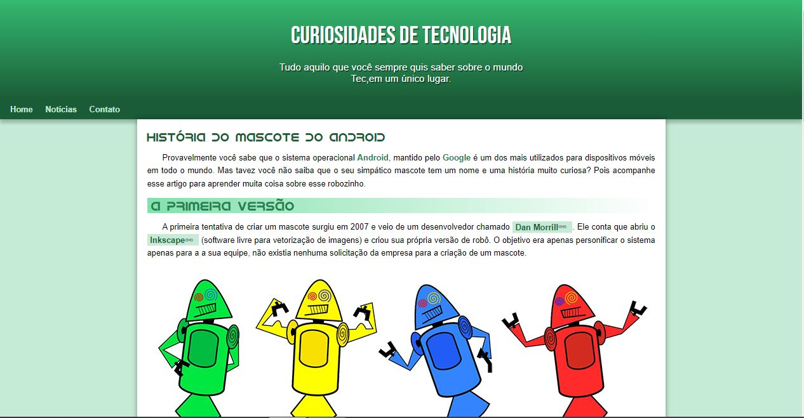
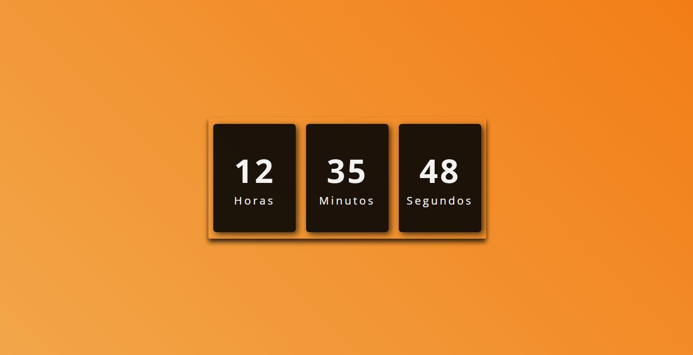
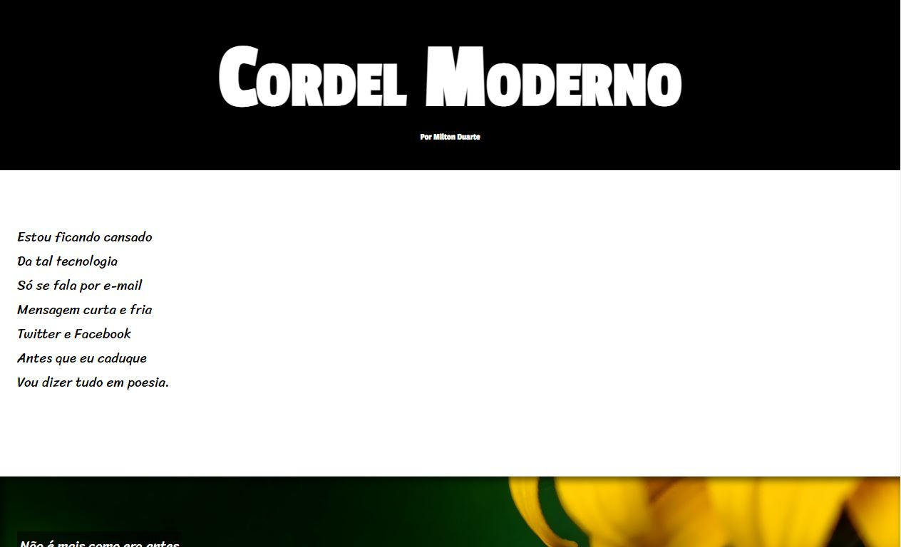
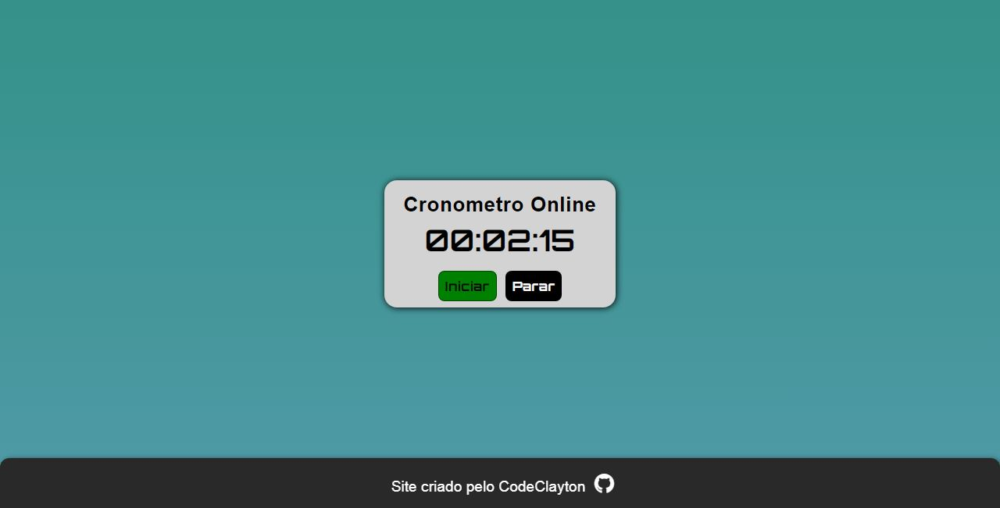
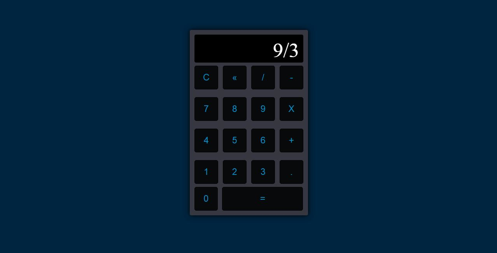
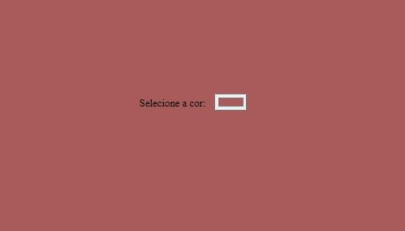

# Projetos HTML, CSS e JS :computer:

Bem-vindo à minha coleção de projetos de desenvolvimento web! Aqui estão alguns dos meus projetos criados com HTML, CSS e JavaScript.

## 01. Projeto Android :iphone:

Projeto do Curso em Video de HTML e CSS

Imagem:

Link: [Projeto Android](https://codeclayton.github.io/Projetos-HTML-CSS-JS/01-Projeto-Android/#)

---

## 02. Projeto Relógio ⏰

Relogio da hora atual, que muda o fundo degradê de acordo com o hórario

Imagem:

Link: [Projeto Relógio](https://codeclayton.github.io/Projetos-HTML-CSS-JS/02-Projeto-Relogio/)

---

## 03. Projeto Cordel :scroll:

projeto do Curso em video de um cordel com efeito paralax

Imagem:

Link: [Projeto Cordel](https://codeclayton.github.io/Projetos-HTML-CSS-JS/03-projeto-cordel/)

---

## 04. Projeto Cronômetro ⏱️

Um cronometro criado com HTML CSS JS 

Imagem:

Link: [Projeto Cronômetro](https://codeclayton.github.io/Projetos-HTML-CSS-JS/04-projeto-cronometro/)

---

## 05. Calculadora Simples 🧮

Uma calculadora que efetua as operações de:

-Soma
-Subtração
-Multiplicação
-Divisão

Imagem:

Link: [Calculadora Simples](https://codeclayton.github.io/Projetos-HTML-CSS-JS/05-Calculadora-Simples/)

---

## 06. Change Background 🌈

Selecionar qual será o fundo com JS

Imagem:

Link: [Change Background](https://codeclayton.github.io/Projetos-HTML-CSS-JS/06-Change-Background/)

---

## 07. Text Reveal ✨

Uma animação de Text Reveal com Keyframes 

Imagem:

Link: [Text Reveal](https://codeclayton.github.io/Projetos-HTML-CSS-JS/07-Text-Reveal/)

---

## 08. Lamp Broken 💡

Breve descrição do Lamp Broken.

Imagem:

Link: [Lamp Broken](https://github.com/seu-usuario/08-Lamp-Broken)

---

## 09. Background Degradee 🌅

Breve descrição do Background Degradee.

Imagem:

Link: [Background Degradee](https://github.com/seu-usuario/09-Background-Degradee)

---

## 10. Seguir Cursor 🐭

Breve descrição do Seguir Cursor.

Imagem:

Link: [Seguir Cursor](https://github.com/seu-usuario/10-Seguir-Cursor)

---

Espero que você goste dos projetos! Se tiver alguma pergunta ou quiser colaborar, sinta-se à vontade para entrar em contato. :email: