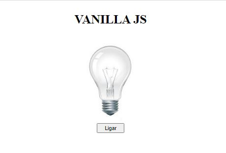
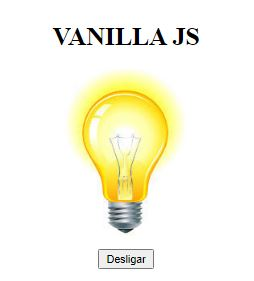
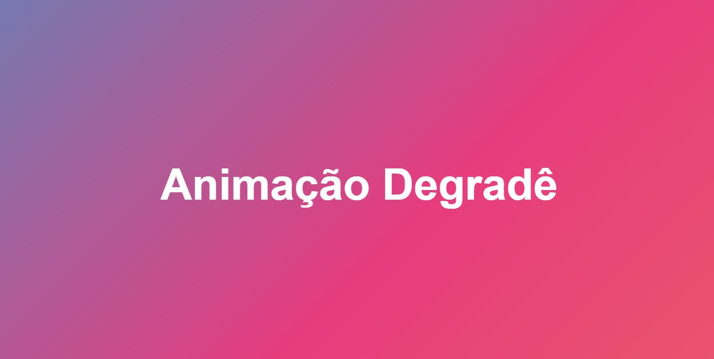
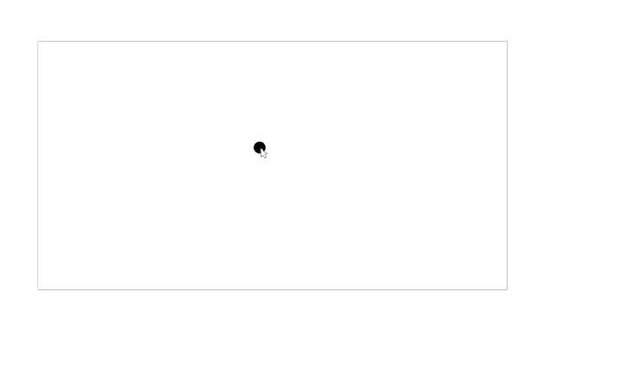

# Projetos HTML, CSS e JS :computer:

Bem-vindo à minha coleção de projetos de desenvolvimento web! Aqui estão alguns dos meus projetos criados com HTML, CSS e JavaScript.

## 01. Projeto Android :iphone:

Projeto do Curso em Video de HTML e CSS

Imagem:

Link: [Projeto Android](https://codeclayton.github.io/Projetos-HTML-CSS-JS/01-Projeto-Android/#)

---

## 02. Projeto Relógio ⏰

Relogio da hora atual, que muda o fundo degradê de acordo com o hórario

Imagem:

Link: [Projeto Relógio](https://codeclayton.github.io/Projetos-HTML-CSS-JS/02-Projeto-Relogio/)

---

## 03. Projeto Cordel :scroll:

Projeto do Curso em video de um cordel com efeito paralax

Imagem:

Link: [Projeto Cordel](https://codeclayton.github.io/Projetos-HTML-CSS-JS/03-projeto-cordel/)

---

## 04. Projeto Cronômetro ⏱️

Um cronometro criado com HTML CSS JS 

Imagem:

Link: [Projeto Cronômetro](https://codeclayton.github.io/Projetos-HTML-CSS-JS/04-projeto-cronometro/)

---

## 05. Calculadora Simples 🧮

Uma calculadora que efetua as operações de:

-Soma  
-Subtração  
-Multiplicação  
-Divisão  

Imagem:

Link: [Calculadora Simples](https://codeclayton.github.io/Projetos-HTML-CSS-JS/05-Calculadora-Simples/)

---

## 06. Change Background 🌈

Selecionar qual será o fundo com JS

Imagem:
[Change Background](06-Change-Background/Preview-Change-Background.JPG)

Link: [Change Background](https://codeclayton.github.io/Projetos-HTML-CSS-JS/06-Change-Background/)

---

## 07. Text Reveal ✨

Um projeto de revelação de texto animado criado usando HTML, CSS e JavaScript.

Link para o Vídeo de Demonstração:
[Assista ao Vídeo](https://youtu.be/Dr6aCVIemGg?si=lDKlsEMYbB9SnioZ)

Link: [Text Reveal](https://codeclayton.github.io/Projetos-HTML-CSS-JS/07-Text-Reveal/)

---

## 08. Lamp Broken 💡

Um pequeno projeto de interruptor de lâmpada interativo usando HTML, CSS e JavaScript.

Imagens:

Link: [Lamp Broken](https://codeclayton.github.io/Projetos-HTML-CSS-JS/08-Lamp-Broken/)

---

## 09. Background Degradê 🌅

Um site com degradê em movimento com Keyframes

Imagem:

Link: [Background Degrade](https://codeclayton.github.io/Projetos-HTML-CSS-JS/09-Background-Degrade/)

---

## 10. Seguir Cursor 🐭

Projeto divertido onde o elemento segue o cursor do mouse.

Imagem:

Link: [Seguir Cursor](https://codeclayton.github.io/Projetos-HTML-CSS-JS/10-Seguir-Cursor/)

Espero que você goste dos projetos! Se tiver alguma pergunta ou quiser colaborar, sinta-se à vontade para entrar em contato.